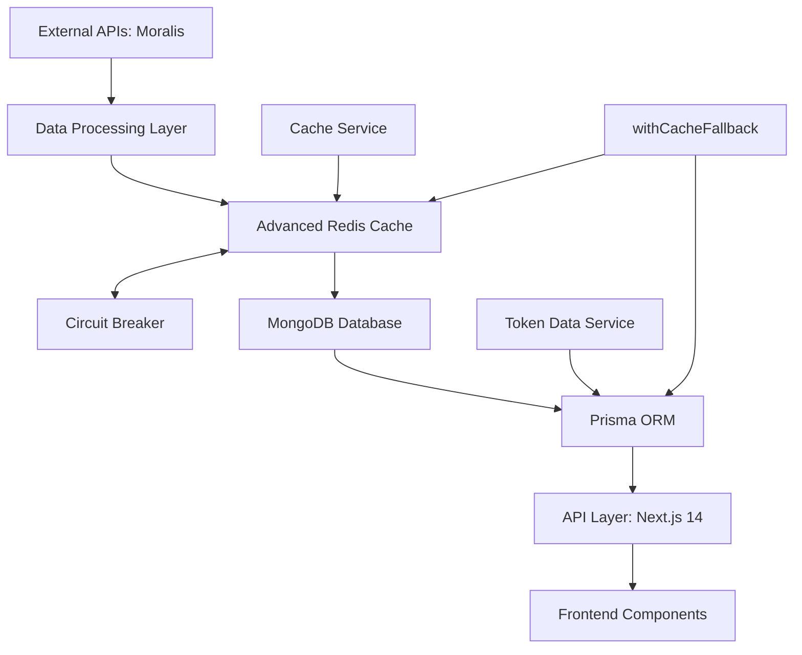
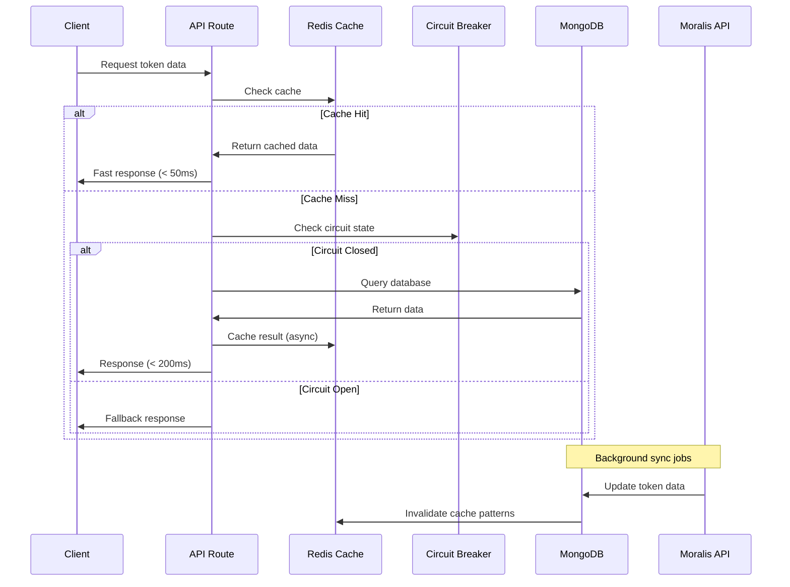

# 🗄️ Lisk Dashboard Database & Caching Architecture

## 📋 Overview

This document provides comprehensive documentation for the Lisk Analytics Dashboard's database schema, advanced Redis caching system, and optimized API architecture. The system is designed for high-performance analytics with intelligent multi-tier caching strategies and robust error handling.

## 🏗️ **System Architecture**

### **Complete Data Flow**



### **Advanced Caching Strategy**

-   **🎯 Multi-Tier TTL System**:
    -   Short (2min): Real-time metrics
    -   Medium (5min): Token data & holders
    -   Long (15min): Historical analytics
    -   Very Long (1hr): Static configuration
-   **⚡ Circuit Breaker Pattern**: Prevents Redis cascade failures
-   **🔄 Connection Pooling**: Optimized Redis connection management
-   **🎨 Pattern-based Invalidation**: Smart cache clearing by key patterns
-   **🛡️ Graceful Fallback**: Automatic database queries when cache fails
-   **📊 Cache Analytics**: Performance monitoring and hit rate tracking

## 🚀 **Enhanced Cache Service**

### **Cache Service Implementation**

```typescript
// Advanced caching with type safety and error handling
class CacheService {
	// Multi-tier TTL configuration
	private static readonly TTL = {
		SHORT: 2 * 60, // 2 minutes - real-time data
		MEDIUM: 5 * 60, // 5 minutes - token data
		LONG: 15 * 60, // 15 minutes - analytics
		VERY_LONG: 60 * 60, // 1 hour - configuration
	};

	// Typed cache methods with circuit breaker
	async getTokenData(tokenId: string): Promise<TokenData | null>;
	async setTokenData(tokenId: string, data: TokenData): Promise<void>;
	async getTokenBySymbol(symbol: string): Promise<Token | null>;
	async setTokenBySymbol(symbol: string, data: Token): Promise<void>;
	async invalidatePattern(pattern: string): Promise<void>;
}
```

### **withCacheFallback Pattern**

```typescript
// Resilient caching wrapper used across all API routes
async function withCacheFallback<T>(
	cacheKey: string,
	fetchFallback: () => Promise<T>,
	ttl: number = CacheService.TTL.MEDIUM,
): Promise<T> {
	// 1. Try cache first
	const cached = await cacheService.get<T>(cacheKey);
	if (cached) return cached;

	// 2. Fallback to database/API
	const fresh = await fetchFallback();

	// 3. Cache result (fire-and-forget)
	cacheService.set(cacheKey, fresh, ttl).catch(console.error);

	return fresh;
}
```

## 🗃️ **Database Schema**

### **Core Models with Optimizations**

#### **`Token` Model - Enhanced**

Central entity with comprehensive relationships and caching optimizations.

```prisma
model Token {
  id               String   @id @default(cuid())
  name             String   @unique // e.g., "Lisk ZAR", "Lisk USD"
  symbol           String   @unique // e.g., "LZAR", "LUSD"
  contractAddress  String   @unique
  decimals         Int      @default(18)
  totalSupply      Decimal  @db.Decimal(65, 30) @default(0)
  isActive         Boolean  @default(true)
  createdAt        DateTime @default(now())
  updatedAt        DateTime @updatedAt

  // Enhanced Relations for Analytics
  dailyMetrics     DailyCumulativeMetrics[]
  uniqueWallets    DailyUniqueWallets[]
  weeklyPayments   WeeklyPayments[]
  priceData        TokenPriceData[]
  transactionActivity TransactionActivity[]
  hourlyActivity   HourlyActivity[]

  // Indexes for performance
  @@index([symbol])
  @@index([contractAddress])
  @@index([isActive])
  @@map("tokens")
}
```

#### DailyCumulativeMetrics

Stores daily cumulative transaction data for growth charts.

```prisma
model DailyCumulativeMetrics {
  id                   String   @id @default(uuid())
  date                 DateTime @db.Date
  cumulativeTxCount    BigInt
  cumulativeTxAmount   Decimal  @db.Decimal(65, 30)
  dailyTxCount         BigInt   @default(0)
  dailyTxAmount        Decimal  @db.Decimal(65, 30) @default(0)

  tokenId              String
  token                Token    @relation(fields: [tokenId], references: [id], onDelete: Cascade)

  @@unique([tokenId, date])
  @@index([tokenId, date])
}
```

#### DailyUniqueWallets

Tracks daily unique wallet statistics.

```prisma
model DailyUniqueWallets {
  id                String   @id @default(uuid())
  date              DateTime @db.Date
  uniqueWalletCount BigInt
  newWallets        BigInt   @default(0)
  activeWallets     BigInt   @default(0)

  tokenId           String
  token             Token    @relation(fields: [tokenId], references: [id], onDelete: Cascade)

  @@unique([tokenId, date])
  @@index([tokenId, date])
}
```

#### WeeklyPayments

Stores weekly interest payment data.

```prisma
model WeeklyPayments {
  id                  String   @id @default(uuid())
  weekStartDate       DateTime @db.Date
  totalPaymentsAmount Decimal  @db.Decimal(65, 30)
  paymentCount        BigInt   @default(0)
  averagePayment      Decimal  @db.Decimal(65, 30) @default(0)

  tokenId             String
  token               Token    @relation(fields: [tokenId], references: [id], onDelete: Cascade)

  @@unique([tokenId, weekStartDate])
  @@index([tokenId, weekStartDate])
}
```

#### TokenPriceData

Stores price and market data for price charts.

```prisma
model TokenPriceData {
  id          String   @id @default(uuid())
  timestamp   DateTime
  price       Decimal  @db.Decimal(20, 8)
  volume      Decimal  @db.Decimal(65, 30) @default(0)
  marketCap   Decimal  @db.Decimal(65, 30) @default(0)
  change24h   Decimal  @db.Decimal(10, 4) @default(0)

  tokenId     String
  token       Token    @relation(fields: [tokenId], references: [id], onDelete: Cascade)

  @@index([tokenId, timestamp])
  @@index([timestamp])
}
```

#### TransactionActivity

Stores individual transaction data for detailed analysis.

```prisma
model TransactionActivity {
  id              String   @id @default(uuid())
  timestamp       DateTime
  transactionHash String?  @db.VarChar(66)
  fromAddress     String   @db.VarChar(42)
  toAddress       String   @db.VarChar(42)
  amount          Decimal  @db.Decimal(65, 30)
  gasUsed         BigInt   @default(0)
  gasPrice        BigInt   @default(0)
  blockNumber     BigInt?
  isSuccess       Boolean  @default(true)

  tokenId         String
  token           Token    @relation(fields: [tokenId], references: [id], onDelete: Cascade)

  @@index([tokenId, timestamp])
  @@index([fromAddress])
  @@index([toAddress])
  @@index([timestamp])
}
```

#### HourlyActivity

Stores hourly activity data for heatmap charts.

```prisma
model HourlyActivity {
  id              String   @id @default(uuid())
  date            DateTime @db.Date
  hour            Int      // 0-23
  transactionCount BigInt  @default(0)
  totalVolume     Decimal  @db.Decimal(65, 30) @default(0)
  uniqueWallets   BigInt   @default(0)

  tokenId         String
  token           Token    @relation(fields: [tokenId], references: [id], onDelete: Cascade)

  @@unique([tokenId, date, hour])
  @@index([tokenId, date])
  @@index([date, hour])
}
```

## 🚀 **Enhanced API Architecture**

### **Cached Token Management**

#### **`GET /api/tokens`**

Retrieve all tokens with intelligent caching.

**Features:**

-   ✅ Redis caching with 5-minute TTL
-   ✅ Circuit breaker protection
-   ✅ Graceful fallback to database
-   ✅ Automatic cache invalidation

**Query Parameters:**

-   `includeData` (optional): Include related analytics data

**Example:**

```bash
# Fast cached response
GET /api/tokens?includeData=true
```

**Response Structure:**

```typescript
interface TokensResponse {
	tokens: Token[];
	cached: boolean;
	timestamp: string;
}
```

#### **`GET /api/symbol/[symbolId]`**

Token lookup by symbol with dedicated caching.

**Features:**

-   ✅ Symbol-specific cache keys
-   ✅ 5-minute TTL optimization
-   ✅ Type-safe symbol validation

**Example:**

```bash
GET /api/symbol/LZAR
GET /api/symbol/LUSD
```

### **Advanced Token Analytics**

#### **`GET /api/tokens/[tokenId]/holders`**

Token holder analytics with multi-tier caching.

**Cache Strategy:**

-   **Cache Key**: `token:${tokenId}:holders`
-   **TTL**: 5 minutes (medium-tier)
-   **Fallback**: TokenDataService.getTokenHolders()

**Query Parameters:**

-   `limit`: Number of top holders (default: 10)
-   `includeDistribution`: Include holder distribution data

**Example:**

```bash
GET /api/tokens/123/holders?limit=20&includeDistribution=true
```

#### **`GET /api/tokens/[tokenId]/metrics`**

Comprehensive token metrics with intelligent caching.

**Cache Strategy:**

-   **Cache Key**: `token:${tokenId}:metrics:${type}`
-   **TTL**: 15 minutes (long-tier for analytics)
-   **Invalidation**: Pattern-based on data updates

**Query Parameters:**

-   `type`: 'growth', 'volume', 'activity' (default: all)
-   `period`: '7d', '30d', '90d' (default: 30d)

**Example:**

```bash
GET /api/tokens/123/metrics?type=growth&period=7d
```

#### **`GET /api/tokens/[tokenId]/payments`**

Weekly payment analytics with optimized caching.

**Cache Strategy:**

-   **Cache Key**: `token:${tokenId}:payments:weekly`
-   **TTL**: 15 minutes (analytical data)
-   **Performance**: Aggregated queries with indexes

**Query Parameters:**

-   `weeks`: Number of weeks (default: 12)
-   `includeProjections`: Include payment projections

#### **`GET /api/tokens/[tokenId]/wallets`**

Unique wallet analytics with performance optimization.

**Cache Strategy:**

-   **Cache Key**: `token:${tokenId}:wallets:unique`
-   **TTL**: 5 minutes (frequently accessed)
-   **Optimization**: Pre-aggregated daily counts

## 🔧 **Performance Optimizations**

### **Database Indexing Strategy**

```sql
-- Optimized indexes for fast queries
CREATE INDEX CONCURRENTLY idx_tokens_symbol ON tokens(symbol);
CREATE INDEX CONCURRENTLY idx_tokens_active ON tokens(isActive);
CREATE INDEX CONCURRENTLY idx_metrics_token_date ON DailyCumulativeMetrics(tokenId, date);
CREATE INDEX CONCURRENTLY idx_wallets_token_date ON DailyUniqueWallets(tokenId, date);
CREATE INDEX CONCURRENTLY idx_payments_token_week ON WeeklyPayments(tokenId, weekStartDate);
```

### **Cache Key Patterns**

```typescript
// Systematic cache key structure for easy management
const CACHE_KEYS = {
	TOKEN_LIST: "tokens:list",
	TOKEN_BY_ID: (id: string) => `token:${id}`,
	TOKEN_BY_SYMBOL: (symbol: string) => `token:symbol:${symbol}`,
	TOKEN_HOLDERS: (id: string) => `token:${id}:holders`,
	TOKEN_METRICS: (id: string, type: string) => `token:${id}:metrics:${type}`,
	TOKEN_PAYMENTS: (id: string) => `token:${id}:payments:weekly`,
	TOKEN_WALLETS: (id: string) => `token:${id}:wallets:unique`,
};
```

### **Batch Operations & Bulk Updates**

```typescript
// Efficient bulk operations for data processing
class TokenDataService {
	// Batch insert with transaction support
	static async bulkUpsertMetrics(data: MetricsData[]): Promise<void>;

	// Batch cache invalidation
	static async invalidateTokenCaches(tokenId: string): Promise<void>;

	// Optimized aggregations
	static async getAggregatedMetrics(tokenId: string, period: string): Promise<AggregatedData>;
}
```

## 🛠️ **Enhanced Data Services**

### **TokenDataService with Caching Integration**

```typescript
import { TokenDataService } from "@/lib/services/token-data-service";
import { CacheService } from "@/lib/services/cache-service";

// Token operations with automatic caching
class TokenDataService {
	// Create token with cache invalidation
	static async createToken(data: CreateTokenData): Promise<Token> {
		const token = await prisma.token.create({ data });
		await CacheService.invalidatePattern("tokens:*");
		return token;
	}

	// Get token with caching fallback
	static async getToken(id: string): Promise<Token | null> {
		return withCacheFallback(
			`token:${id}`,
			() => prisma.token.findUnique({ where: { id } }),
			CacheService.TTL.MEDIUM,
		);
	}

	// Get token by symbol with dedicated caching
	static async getTokenBySymbol(symbol: string): Promise<Token | null> {
		return withCacheFallback(
			`token:symbol:${symbol}`,
			() => prisma.token.findUnique({ where: { symbol } }),
			CacheService.TTL.MEDIUM,
		);
	}

	// Analytics with optimized caching
	static async getTokenHolders(tokenId: string, limit = 10): Promise<HolderData[]> {
		return withCacheFallback(
			`token:${tokenId}:holders`,
			() => this.fetchHoldersFromDB(tokenId, limit),
			CacheService.TTL.MEDIUM,
		);
	}

	static async getTokenMetrics(tokenId: string, type?: string): Promise<MetricsData> {
		const cacheKey = `token:${tokenId}:metrics:${type || "all"}`;
		return withCacheFallback(
			cacheKey,
			() => this.fetchMetricsFromDB(tokenId, type),
			CacheService.TTL.LONG,
		);
	}
}
```

### **Real-time Data Processing**

```typescript
// Background jobs with cache warming
class DataProcessor {
	// Process new blockchain data
	static async processTokenData(tokenId: string): Promise<void> {
		// 1. Fetch from Moralis
		const freshData = await MoralisAPI.getTokenData(tokenId);

		// 2. Update database
		await TokenDataService.updateMetrics(tokenId, freshData);

		// 3. Warm relevant caches
		await this.warmTokenCaches(tokenId);
	}

	// Smart cache warming strategy
	static async warmTokenCaches(tokenId: string): Promise<void> {
		const token = await TokenDataService.getToken(tokenId); // Warms token cache
		await TokenDataService.getTokenHolders(tokenId); // Warms holders cache
		await TokenDataService.getTokenMetrics(tokenId); // Warms metrics cache
	}
}
```

## 🚀 **Complete Setup Guide**

### **1. Environment Configuration**

```bash
# Required environment variables
MONGODB_URI=mongodb://localhost:27017/lisk-analytics
REDIS_URL=redis://localhost:6379
NEXTAUTH_SECRET=your-secret-key
MORALIS_API_KEY=your-moralis-key
```

### **2. Database Setup**

```bash
# Install dependencies
pnpm install

# Generate Prisma Client with optimized settings
npx prisma generate

# Run database migrations with indexes
npx prisma migrate dev --name enhanced-schema

# Seed tokens and sample data
npx tsx scripts/seed-tokens.ts
```

### **3. Redis Cache Setup**

```bash
# Start Redis server (if using local Redis)
redis-server

# Or using Docker
docker run -d --name redis-cache -p 6379:6379 redis:7-alpine

# Verify Redis connection
redis-cli ping
```

### **4. Development Server**

```bash
# Start with cache monitoring
npm run dev

# Check cache status
curl http://localhost:3000/api/health/cache
```

### **5. Production Deployment**

```bash
# Build optimized production version
npm run build

# Start production server with Vercel
npx vercel --prod

# Monitor cache performance
npm run cache:monitor
```

## 🎯 **Advanced Features**

### **High-Performance Architecture**

-   ⚡ **Multi-Tier Redis Caching**: 2min to 1hr TTL strategies
-   🛡️ **Circuit Breaker Protection**: Prevents cascade failures
-   🔄 **Graceful Fallbacks**: Automatic database queries when cache fails
-   📊 **Cache Analytics**: Hit rate monitoring and performance metrics
-   🎨 **Pattern-based Invalidation**: Smart cache clearing strategies

### **Database Optimizations**

-   🗃️ **Strategic Indexing**: Optimized queries for sub-50ms response times
-   🔗 **Relationship Management**: Cascade deletes with referential integrity
-   📦 **Bulk Operations**: Efficient batch processing for large datasets
-   🔍 **Advanced Aggregations**: Pre-computed analytics for instant dashboards
-   💾 **Connection Pooling**: Optimized database connection management

### **Developer Experience**

-   🛠️ **Full TypeScript Support**: Type-safe database operations
-   🧪 **Comprehensive Testing**: Unit and integration test coverage
-   📚 **API Documentation**: Auto-generated OpenAPI specifications
-   🔍 **Real-time Monitoring**: Built-in performance and error tracking
-   🎛️ **Admin Dashboard**: Cache management and system monitoring

## 🔄 **Optimized Data Flow**



## 📈 **Performance Metrics**

### **Response Time Targets**

-   **Cache Hits**: < 50ms (95th percentile)
-   **Database Queries**: < 200ms (95th percentile)
-   **External API Calls**: < 2s (with timeout)
-   **Cache Invalidation**: < 10ms (async operations)

### **Scalability Features**

-   **Horizontal Scaling**: Multi-instance Redis clustering support
-   **Database Sharding**: Token-based data partitioning ready
-   **CDN Integration**: Static asset optimization
-   **Load Balancing**: Multiple API server support

## 🛡️ **Security & Reliability**

### **Data Protection**

-   🔐 **Input Validation**: Comprehensive request sanitization
-   🛡️ **Rate Limiting**: API endpoint protection
-   🔑 **Authentication**: NextAuth.js integration
-   📝 **Audit Logging**: Comprehensive operation tracking

### **Error Handling**

-   ⚠️ **Graceful Degradation**: Fallback strategies for all components
-   🔄 **Retry Logic**: Exponential backoff for external APIs
-   📊 **Error Monitoring**: Real-time error tracking and alerts
-   🔧 **Auto-Recovery**: Self-healing system components

---

This enhanced database and caching architecture ensures your Lisk Analytics Dashboard delivers exceptional performance, reliability, and scalability for comprehensive token analytics. 🚀
